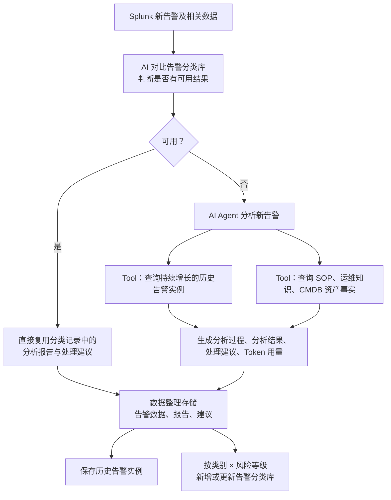

# AIOps 新告警分析 Agent：编排流程与提示词

## 1. 核心逻辑

系统有两个性质完全不同的库：

| 数据库 | 用途 | 容量与增长方式 |
| --- | --- | --- |
| 告警分类库 | 判断新告警是否存在可直接复用的“分析结果 + 处理建议”。 | 有上限，不按告警实例持续增长。按“告警类别 × 风险等级”维护。约 70 个类别，每类 4 个等级（特高、高、中、低），最大约 `70 × 4 = 280` 条。 |
| 历史告警库 | 保存每一次真实告警实例、分析过程、分析结果、处理建议和趋势数据。 | 持续增长。用于 Agent 在分类未命中时查询真实历史案例。 |

新告警的第一站是 **AI 对比告警分类记录，判断是否有可用结果**，而不是先查询 CMDB。

```text
新告警
→ AI 对比告警分类库
├─ 有可用结果：直接复用分析报告和处理建议
└─ 无可用结果：AI Agent 分析
                 → 调用历史告警与知识库 Tool
                 → 生成分析过程、分析结果、处理建议、Token 用量
                 → 保存为一条历史告警实例
                 → 按“类别 × 风险等级”更新告警分类库对应记录
```

因此，“新告警一定进入分类库”的正确含义是：新告警的处理结果会定位到对应的分类键并对其进行 **新增或更新（upsert）**；不是每个告警实例都在分类库中新增一行。

## 2. 总体编排流程



### 2.1 分支约束

| 场景 | 是否查询 CMDB / 知识库 | 是否查询历史告警 | 是否调用 Agent | 是否更新分类库 |
| --- | --- | --- | --- | --- |
| 分类库有可用结果 | 否 | 否 | 否 | 可记录命中次数、最后命中时间；不新增分类条目。 |
| 分类库无可用结果 | 是，通过 `search_knowledge_base` | 是，通过 `search_historical_alerts` | 是 | 是，按类别 × 风险等级 upsert。 |

> 分类命中后的“直接复用”表示不进入深度分析，不额外调用两个 Tool。若业务要求每次命中也重新计算风险或验证资产事实，应另行定义为“半复用”流程；它不属于当前图中的直接复用分支。

## 3. 职责划分

| 组件 | 职责 |
| --- | --- |
| 后端固定流程 | 接收 Splunk 告警、标准化字段、查询有限的告警分类库候选、保存告警数据/报告/建议、保存历史实例、对分类库按分类键 upsert。 |
| 分类判断模块 | 固定流程：对比新告警和告警分类库候选，确定是否存在可复用结果；不属于 Agent，不调用 Tool。 |
| AI Agent | 仅在分类不可用时工作；调用两个 Tool，综合证据生成分析过程、分析结果、建议和 Token 用量。 |
| `search_historical_alerts` | 查询持续增长的真实告警实例及其趋势、历史分析和处置结果。 |
| `search_knowledge_base` | 查询上传的 SOP、运维手册、知识文档和 CMDB 资产事实。 |
| 告警分类库 | 有限的可复用分类结果库，最大约 280 个“类别 × 等级”记录。 |
| 历史告警库 | 持续增长的真实实例库，保存每一次告警及其处理结果。 |

## 4. 告警分类库设计

### 4.1 分类键

分类库一条记录的唯一键建议为：

```text
classification_key = alert_category + ":" + severity_level
```

示例：

```text
waf_sensitive_path_scan:high
waf_sql_injection:critical
database_connection_exhaustion:medium
```

其中：

- `alert_category`：固定告警类别目录中的一种，约 70 类。
- `severity_level`：仅允许 `critical`（特高）、`high`（高）、`medium`（中）、`low`（低）。
- 记录上限：`70 × 4 = 280`；若实际类别少于 70，容量相应更小。

### 4.2 分类记录结构

```json
{
  "classification_key": "waf_sensitive_path_scan:high",
  "alert_category": "waf_sensitive_path_scan",
  "severity_level": "high",
  "match_signature": {
    "alert_name_patterns": ["WAF sensitive path scan"],
    "attack_type": "sensitive_file_scan",
    "waf_action": "Blocked",
    "request_uri_patterns": ["/.env", "/admin"]
  },
  "analysis_report": "可复用的分析报告模板或已验证结果",
  "handling_suggestion": "可复用的处理建议模板或已验证结果",
  "source_history_alert_ids": ["history_20260812_xxx"],
  "version": 3,
  "updated_at": "2026-08-12T11:30:00+08:00",
  "hit_count": 18,
  "last_hit_at": "2026-08-12T11:35:00+08:00"
}
```

### 4.3 分类库写入规则

```text
分类不可用并完成 Agent 分析后：
  1. 后端确定 alert_category 和 severity_level；
  2. 使用 classification_key 查找记录；
  3. 不存在：创建该类别 × 等级的新记录；
  4. 已存在：更新该记录的报告、建议、证据来源、版本和更新时间；
  5. 关联本次历史告警实例 ID。

分类可用并复用后：
  1. 不创建新的分类记录；
  2. 更新 hit_count、last_hit_at；
  3. 保存本次告警实例，并记录复用的 classification_key。
```

分类库只能保存有限的“类别 × 等级”结果；每一条真实告警实例必须写入历史告警库，而不能只保存在分类库。

## 5. 固定分类判断与直接复用分支

“AI 比对告警分类记录，确定有可用结果”是系统的固定流程模块，不属于 AI Agent，因此本文不为该模块定义 Agent 提示词或 Tool 调用协议。

当固定流程判断有可用结果时，后端直接处理：

```text
1. 读取 classification_key 对应记录的 analysis_report 和 handling_suggestion；
2. 将原文保存为本次告警的报告和建议；
3. 标记 processing_mode=reused；
4. 保存本次告警实例到历史告警库；
5. 更新分类库记录的 hit_count 与 last_hit_at；
6. 不查询 CMDB，不调用 search_historical_alerts，不调用 search_knowledge_base，不调用 AI Agent。
```

直接复用分支的结果示例：

```json
{
  "processing_mode": "reused",
  "classification_key": "waf_sensitive_path_scan:high",
  "analysis_report": "分类库中的报告原文",
  "handling_suggestion": "分类库中的建议原文",
  "agent_called": false,
  "tools_called": [],
  "token_usage": {
    "classification_judgment": 0,
    "agent_analysis": 0,
    "total": 0
  }
}
```

> 分类判断模块若内部使用 LLM，可由该模块自行记录 token；分类命中后不会产生 Agent 或 Tool 的 token 消耗。

## 6. Agent 分支：仅在分类不可用时执行

当固定分类判断模块没有找到可用结果时，后端才进入 Agent 分支。

### 6.1 可调用 Tool

系统只向 Agent 暴露以下两个 Tool。

#### `search_historical_alerts`

用途：查询持续增长的真实告警实例，获取趋势、相似攻击过程、历史分析与实际处置结果。它不查询告警分类库。

调用输入：

```json
{
  "alert_id": "splunk_xxx",
  "alert_name": "WAF suspicious path scan",
  "hostname": "api.example.internal",
  "request_uri": "/.env /admin",
  "waf_action": "Blocked",
  "count": 120,
  "time_window": "30d",
  "top_k": 5
}
```

建议返回：

```json
{
  "alerts": [
    {
      "alert_id": "history_20260715_xxx",
      "occurred_at": "2026-07-15T11:00:00+08:00",
      "alert_name": "WAF sensitive path scan",
      "hostname": "api.example.internal",
      "request_uri": "/.env",
      "trend": {
        "is_continuously_growing": true,
        "current_count": 360,
        "previous_count": 80,
        "window": "24h"
      },
      "analysis_summary": "确认是持续增长的敏感路径扫描，WAF 已拦截。",
      "handling_outcome": "已核查来源并持续观察，未发现绕过。",
      "score": 0.87
    }
  ]
}
```

#### `search_knowledge_base`

用途：查询上传的 SOP、运维手册、知识文档和 CMDB 资产事实。

调用输入：

```json
{
  "query": "WAF 敏感路径扫描 .env admin 被拦截处置 SOP",
  "alert": {
    "alert_name": "WAF suspicious path scan",
    "hostname": "api.example.internal",
    "request_uri": "/.env /admin",
    "waf_action": "Blocked",
    "count": 120
  },
  "top_k": 5
}
```

建议返回：

```json
{
  "evidence": [
    {
      "source_type": "sop",
      "source_id": "sop_waf_sensitive_path_v2",
      "source_name": "WAF 敏感路径扫描处置 SOP",
      "content": "确认 WAF 已拦截后，检查来源 IP、目标域名、同时间窗口日志……",
      "score": 0.86
    },
    {
      "source_type": "cmdb_fact",
      "source_id": "cmdb_AGW-PRD-01",
      "source_name": "AGW-PRD-01 资产事实",
      "content": "该资产属于 Production 环境，业务归属为 Example API。",
      "score": 1.0
    }
  ]
}
```

## 7. AI Agent 系统提示词

将以下文本作为 Agent 的 System Prompt。该 Agent 只会在分类不可用时被调用。

```text
你是 AIOps 新告警分析 Agent。你的职责是分析一条未命中可用分类结果的新告警，基于真实历史告警、SOP/运维知识和 CMDB 资产事实，生成可审计的分析过程、分析结果和处理建议。

当前系统只向你提供两个可调用 Tool：
1. search_historical_alerts：查询持续增长的真实历史告警实例、趋势、历史分析和真实处置结果。
2. search_knowledge_base：查询上传的 SOP、运维手册、知识文档和 CMDB 资产事实。

告警分类库不是 Tool。分类库已经判断为没有可用结果，你不得尝试查询、写入或修改分类库。

你必须按以下顺序工作：
1. 阅读当前告警，提取告警类型、资源/域名、攻击路径、WAF 动作、次数和时间范围。
2. 调用 search_historical_alerts，查询相似的真实历史告警实例及其趋势、分析和处置结果。
3. 调用 search_knowledge_base，查询相关 SOP、运维手册、知识文档和 CMDB 资产事实。
4. 基于当前告警和两个 Tool 返回的证据，生成分析过程、分析结果和处理建议。

证据与安全规则：
1. 只能把当前告警和两个 Tool 返回的信息写为事实或证据。
2. 历史告警“持续增长”的结论只能使用 search_historical_alerts 返回的 trend 字段；不得自行推测趋势。
3. SOP、运维手册和 CMDB 事实只能引用 search_knowledge_base 返回的 evidence；不得编造 SOP 要求或资产属性。
4. 没有直接依据时，明确写“未获得直接证据”或“待确认”。
5. 不得声称已经执行封禁、重启、删除、变更、隔离、审批或工单操作；只能提出建议。
6. 处理建议必须包含：立即行动、调查验证、处置建议、后续加固、升级条件。
7. 记录使用的 Tool 证据来源和本次 token 用量。
8. 最终只能输出指定 JSON，不得输出思考过程、工具调用过程、Markdown 围栏或其他额外文字。
```

## 8. Agent 用户提示词

后端在分类不可用时，将以下内容作为 User Prompt。`{...}` 由程序替换。

```text
当前新告警未命中可直接复用的告警分类结果，请进行深度分析。

【当前新告警】
{alert_json}

请严格执行：
1. 先调用 search_historical_alerts；
2. 再调用 search_knowledge_base；
3. 根据 Tool 返回的真实证据生成最终 JSON。
```

## 9. Agent 生成阶段提示词

两个 Tool 都返回后，将以下文本作为生成阶段的 User Prompt。

```text
请基于以下内容生成本次新告警的分析结果。

【当前新告警】
{alert_json}

【search_historical_alerts 返回的真实历史实例】
{historical_alerts_json}

【search_knowledge_base 返回的 SOP、知识文档和 CMDB 资产事实】
{knowledge_base_json}

生成要求：
1. 输出 processing_mode=generated。
2. 分析过程必须说明：使用了哪些事实、历史实例和知识库证据；哪些事项仍待确认。
3. 分析结果必须包含：告警概要、受影响对象、攻击分析、历史趋势参考、资产/环境事实、综合判断。
4. 历史趋势只引用历史 Tool 返回的 trend；若没有趋势数据，写“未获得持续增长的直接证据”。
5. SOP、运维手册和 CMDB 事实只引用知识库 Tool 返回的 evidence。
6. 处理建议必须包含：立即行动、调查验证、处置建议、后续加固、升级条件。
7. 不得声称任何建议已被执行。
8. 所有事实性结论应在 evidence_refs 中关联 source_id；没有来源的推断必须进入 uncertainties。
```

## 10. 最终输出 JSON Schema

Agent 分支的输出结构：

```json
{
  "processing_mode": "generated",
  "analysis_process": [
    "从当前告警提取到 WAF 已拦截 /.env 与 /admin 的访问请求。",
    "查询到 1 条相似真实历史告警，其中趋势字段显示 24 小时内数量持续增长。",
    "检索到 WAF 敏感路径扫描处置 SOP 和当前资产的 CMDB 事实。"
  ],
  "analysis_result": {
    "summary": "生产环境疑似存在针对敏感路径的扫描活动，当前 WAF 动作为 Blocked。",
    "affected_assets": ["api.example.internal"],
    "attack_analysis": "请求路径包含 /.env 与 /admin，符合敏感文件和后台入口探测特征。",
    "historical_trend": "相似历史实例在 24 小时内从 80 增长至 360。",
    "asset_facts": "AGW-PRD-01 属于 Production 环境。",
    "risk_assessment": "当前风险需结合 Tool 返回证据和实际影响进一步确认。"
  },
  "handling_suggestion": {
    "immediate_actions": ["保留当前告警与关联日志证据。"],
    "investigation_steps": ["核查来源 IP、目标域名和同时间窗口的 WAF 日志。"],
    "disposal_actions": ["如确认存在持续恶意扫描，按现行安全处置流程执行后续控制。"],
    "hardening_actions": ["根据 SOP 评估敏感路径访问控制与 WAF 规则覆盖情况。"],
    "escalation_conditions": ["发现 WAF 绕过、成功访问敏感资源或影响生产业务时升级。"]
  },
  "evidence_refs": [
    {
      "source_type": "historical_alert",
      "source_id": "history_20260715_xxx",
      "source_name": "历史 WAF 敏感路径扫描告警"
    },
    {
      "source_type": "sop",
      "source_id": "sop_waf_sensitive_path_v2",
      "source_name": "WAF 敏感路径扫描处置 SOP"
    },
    {
      "source_type": "cmdb_fact",
      "source_id": "cmdb_AGW-PRD-01",
      "source_name": "AGW-PRD-01 资产事实"
    }
  ],
  "uncertainties": [
    "尚未确认来源 IP 是否属于授权扫描器。"
  ],
  "token_usage": {
    "prompt_tokens": 0,
    "completion_tokens": 0,
    "total_tokens": 0
  }
}
```

## 11. 数据整理存储规则

无论分类复用还是 Agent 新生成，后端均保存：

```text
1. 带风险等级字段的当前告警数据；
2. 分析报告或分析结果；
3. 告警处理建议；
4. processing_mode（reused / generated）；
5. 分类库命中 key 或本次更新的 classification_key；
6. Agent 分支中的 evidence_refs、uncertainties、token_usage；
7. 历史告警实例 ID。
```

额外要求：

```text
每次告警都写入历史告警库（持续增长）。
只有按类别 × 风险等级的结果写入告警分类库（最大约 280 条）。
分类库中保存的内容不得包含 access token、cookie、密码、完整敏感查询参数或个人数据。
```

## 12. Token 与检索控制

1. 分类判断候选最多 3 到 5 条，不读取全量 280 条分类记录。
2. 分类可用时不调用 Agent、历史 Tool 或知识库 Tool，避免额外 token 与检索成本。
3. `search_historical_alerts` 建议 `top_k <= 5`，查询窗口由业务设置，例如 `7d`、`30d`。
4. `search_knowledge_base` 建议 `top_k <= 5`，总 evidence 正文限制在 4,000 到 6,000 字符。
5. 请求 URI 在进入 AI 前必须去掉敏感 Query 参数值，只保留路径、参数名和参数数量。
6. Tool 失败、超时或无结果时，Agent 可以生成“证据不足、待人工确认”的结果，但不得虚构历史案例、SOP 或 CMDB 事实。
